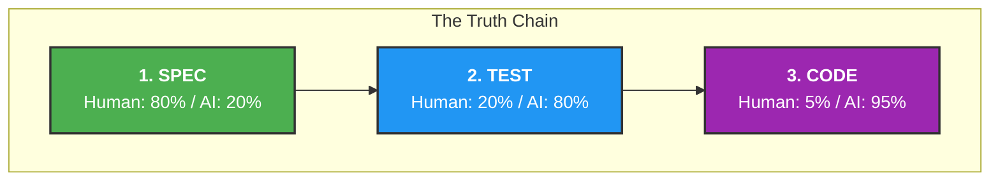

## Hi there 👋

### Manifesto for human developers

1- **UX > DX**: Choose the tech stack that delivers the best performance and native feel for the user. Invest that saved time by AI into maintaining separate, high-quality native codebases rather than compromising with cross-platform wrappers.

2- **The Truth Chain**: Spec $\rightarrow$ Test $\rightarrow$ Code.

Treat the Spec and Tests as the 'Truth'. If the AI implementation passes the tests but fails the spec, the implementation is wrong. We don't write code; we solve problems. The code is just the paperwork the AI files to prove the problem is solved.

3- **Verify**: Treat AI as a talented but hallucinating developer. Use AI to verify itself. 

4- **Hybrid Security**: AI scans for anomalies; SAST scans for rules. Both run on every commit.

5- **Docs-as-Code**: Feature requests are PRs to the design documentation. We review the intent before we write the implementation.

